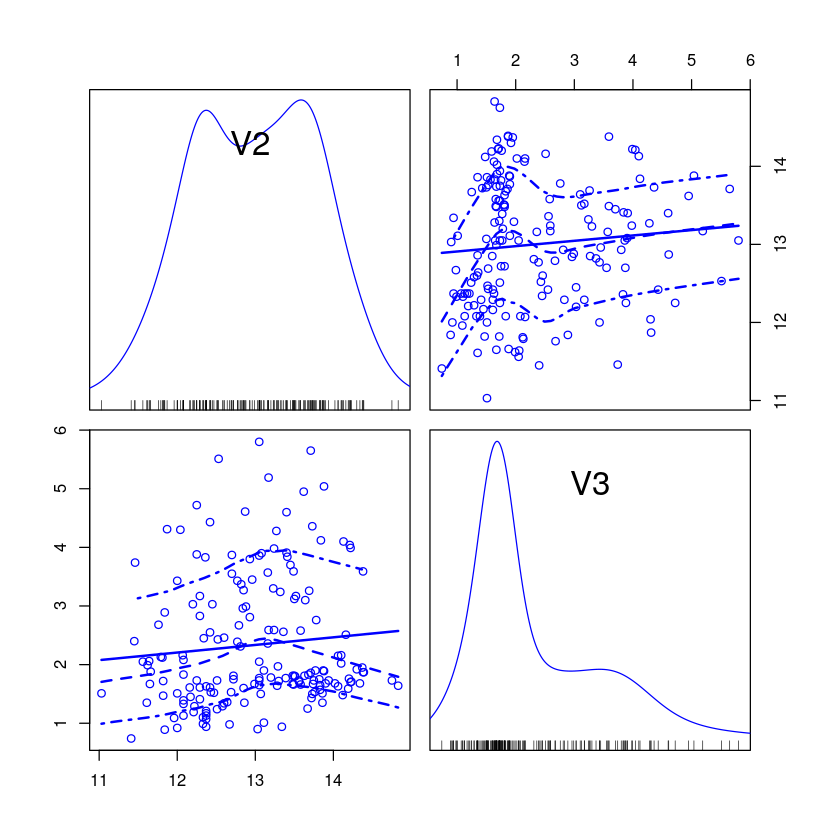
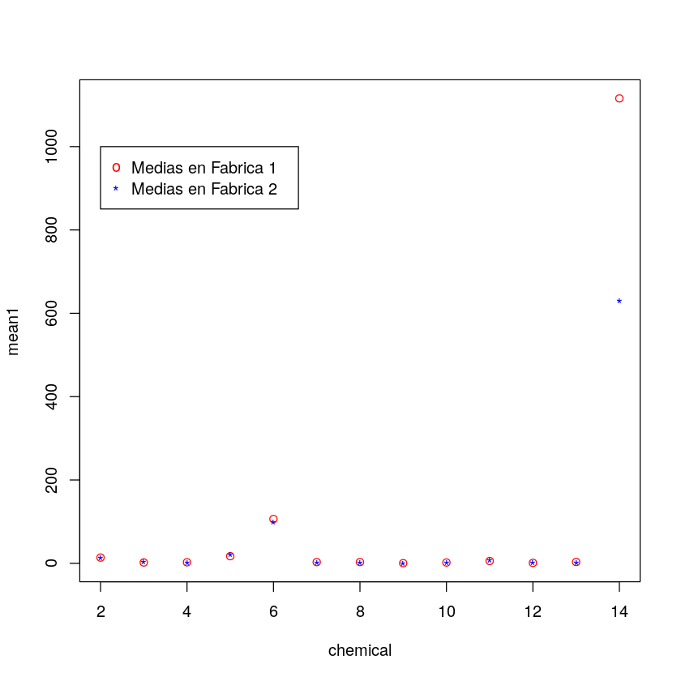
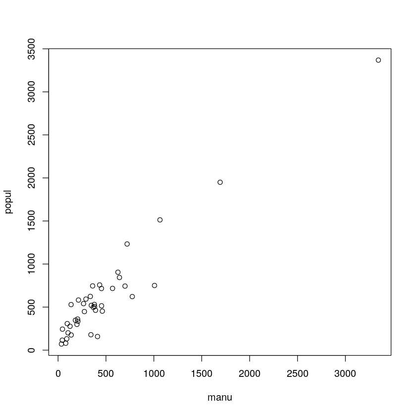
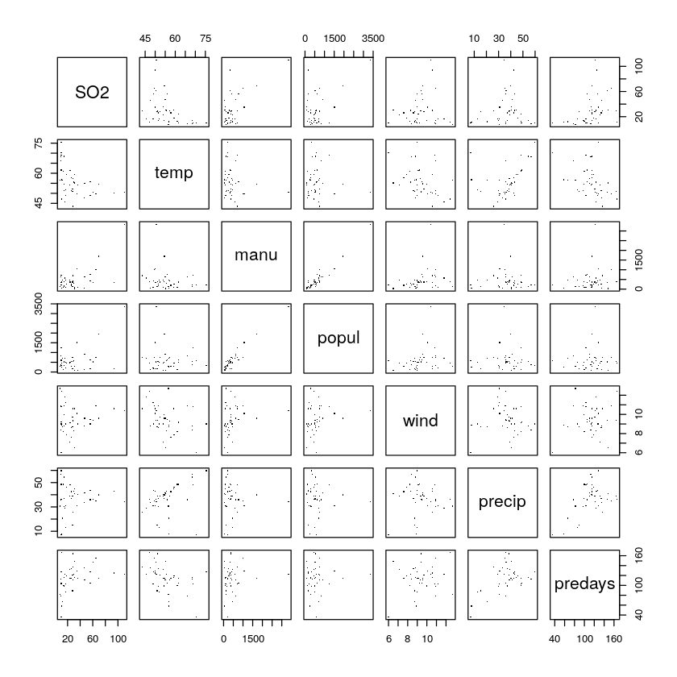
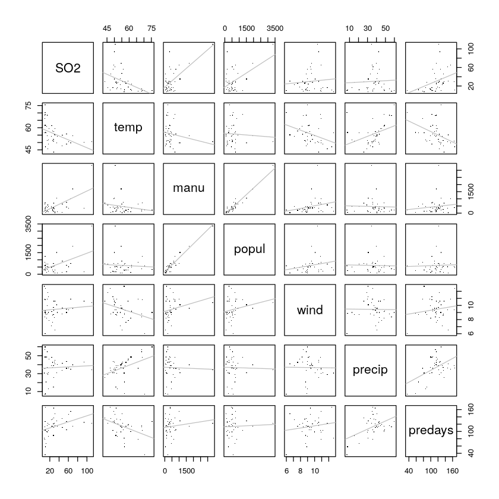
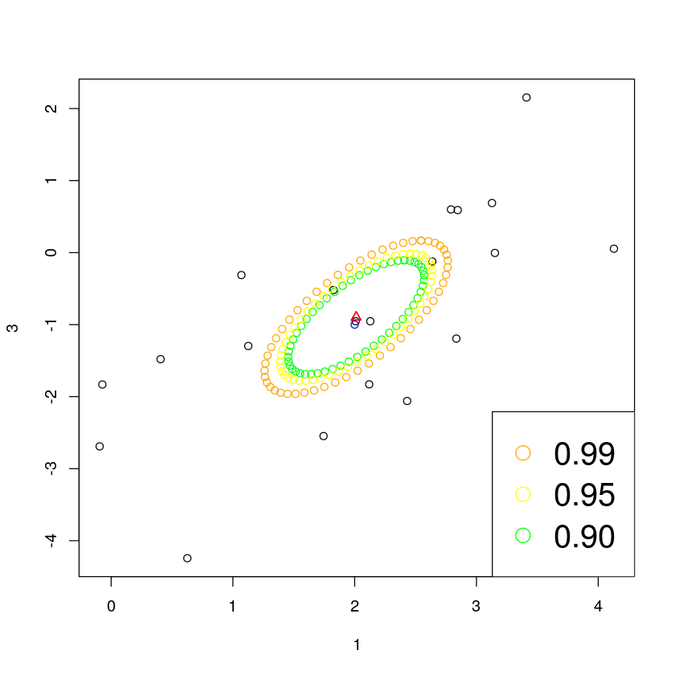
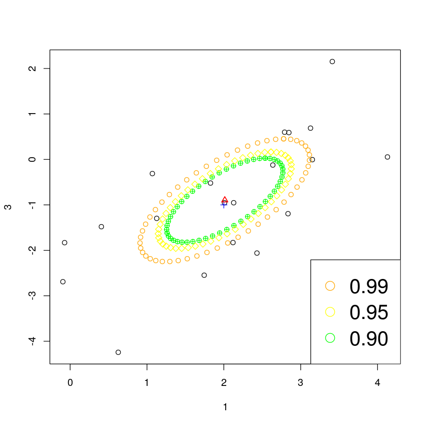

## Dependencias
Instalar paquetes (completar).


```R
install.packages("MVA")
install.packages("HSAUR2")
install.packages("car")
install.packages("MASS")
```

    Updating HTML index of packages in '.Library'

    Making 'packages.html' .
     done

    Updating HTML index of packages in '.Library'

    Making 'packages.html' .
     done

    Updating HTML index of packages in '.Library'

    Making 'packages.html' .
     done

    Updating HTML index of packages in '.Library'

    Making 'packages.html' .
     done


```R
library("MVA")
library("HSAUR2")
library("car")
library("MASS")
```

    Loading required package: HSAUR2

    Loading required package: tools

    Loading required package: carData


# Introducción

## Qué es R

R es un entorno y lenguaje de programación enfocados a la computación estadística y de gráficos. Surge como una reimplementación libre del lenguaje y entorno S. Fue creado en 1993 por Ross Ihaka y Robert Gengleman en el de partamento de estadística de la universidad de Auckland, Nueva Zelanda.

Actualmente está desarrollado por el R Development Core Team. Existe también una activa comunidad que contribuye mediante el reporte de fallos y creación de nuevas funcionalidades.

Su código fuente está escrito principalmente en C, Fortran y el mismo R, y está disponible como software libre bajo los términos de la GNU General Public License de la Free Software Foundation. Puede ser compilado y ejecutado en una gran cantidad de plataformas UNIX, Windows y MacOs.

En este trabajo trataremos de abordar algunas de las funcionalidades básicas que nos ofrece R orientadas a la estadística multivariante.


# Extensiones y paquetes
**R** forma parte de un proyecto colaborativo y abierto donde sus propios usuarios pueden publicar paquetes que extienden su funcionalidad básica.

Para facilitar el desarrollo de nuevos paquetes, se ha puesto a servicio de la comunidad una forja de desarrollo, conocida como **R-Forge**, que facilita las tareas relativas a dicho proceso. Esto es, en definitiva, una plataforma central basada en **FusionForge** para el desarrollo de paquetes, de software relacionado y futuros proyectos.

[A fecha de Diciembre de 2019](https://web.archive.org/web/20191210081209/http://cran.r-project.org/web/packages), el repositorio oficial de paquetes de **R** tiene disponibles 15315 paquetes, los cuales han sido organizados en varias vistas, o temas, que permiten agruparlos según su naturaleza o función. Algunos vistas serían:

+ Bayesian : Vista dedicada a la Inferencia Bayesiana en la que podemos encontrar paquetes para ajustes generalizados de modelos, modelos o métodos específicos, aprender Estadística Bayesiana o que enlazan con motores de muestreo.

+ ChemPhys : En esta vista nos centramos en la Quimiometría y la Física Computacional. Estas disciplinas se ocupan del análisis de los datos que surgen en experimentos de química y física, así como la simulación de los sistemas fisicoquímicos.

+ ClinicalTrials : Vista dedicada al diseño, monitorización y análisis de Ensayos Clínicos.

+ Cluster : Aquí se centran en el Análisis de Clusters y Modelos de Mezcla Finita.

+ Databases : Paquetes relacionados con la accesibilidad a diferentes bases de datos, sin incluir la importación/exportación de datos o su control.

+ DifferentialEquations : Paquetes dedicados al análisis y resolución de Ecuaciones Diferenciales.

+ Distribution : Para las distribuciones clásicas, base R implementa algunas funcionalidades básicas. Estos paquetes están dedicados a aumentar la cantidad de funcionalidades disponibles para el análisis de dichas distribuciones, en particular para las distribuciones multivariantes.

+ Genetics : El enfoque de esta vista está centrada en los paquetes de R que implementan métodos y algoritmos estadísticos para el análisis de datos genéticos y para el estudio de la genética de poblaciones motivada por los grandes avances en el campo del análisis genético de los últimos años.

+ MachineLearning : Dentro de este tema, los paquetes pueden ser divididos en varios topics como pueden ser *Redes Neuronales y Deep Learning*, *Particionamiento Recursivo* o *Bosques Aleatorios*, entre otros muchos.

+ Multivariate : Agrupación de paquetes dedicados a la Estadística Multivariante, siendo que algunos de ellos pueden ser encontrados en algunas otras vistas al dedicarse a varios ámbitos.


# Operaciones básicas

## Hola mundo

Comenzamos viendo las funcionalidades más básicas.  Para asignar valores a varibales podemos utilizar los operadores ``<-``, ``->`` o ``=``. Para hacer comentarios se utiliza ``#``.


```R
# Esto es un comentario
miString <- "Hola mundo"
print(miString)
```

    [1] "Hola mundo"


## Tipos

Para la definición de variables R cuenta con tipos dinámicos, por lo que no es necesario especificar el tipo al declarar la variable. Las variables toman el tipo del valor que se les asigna. Existen séis tipos básicos.


```R
v <- TRUE
print(class(v))
v <- 42
print(class(v))
v <- 2L
print(class(v))
v <- 4+2i
print(class(v))
v <- "multivariante"
print(class(v))
v <- charToRaw("multivariante")
print(class(v))
```

    [1] "logical"
    [1] "numeric"
    [1] "integer"
    [1] "complex"
    [1] "character"
    [1] "raw"


## Estructuras de datos

R implementa las siguientes estructuras de datos

- Vectores. Concatenación de datos del mismo tipo. Si los datos son de distinto tipo, R realiza una transformación automática.
- Listas. Concatenaciones de datos de diferentes tipos, generalmente identificados con un nombre.
- Matrices. Conjunto de datos 2-dimensional rectangular con datos del mismo tipo.
- Arrays. Conjunto de datos n-dimensional.
- Data frames. Objetos tabulares. Cada columna puede contener datos de un tipo diferente.


```R
vector <- c('v1', 'v2', 'v3')
print(vector)
lista <- list(c(1,2,3), 2+3i, "multivariante")
print(lista)
matriz <- matrix(c(1,2,3,4,5,6), nrow = 2, ncol = 3)
print(matriz)
array <- array(c('hola', 'adios'), dim=c(3,2,3))
print(array)
marco <- data.frame(
    nombre = c("A", "B", "C"),
    peso = c(1,2,3),
    cantidad = c(4,5,6)
)
print(marco)
```

    [1] "v1" "v2" "v3"
    [[1]]
    [1] 1 2 3

    [[2]]
    [1] 2+3i

    [[3]]
    [1] "multivariante"

         [,1] [,2] [,3]
    [1,]    1    3    5
    [2,]    2    4    6
    , , 1

         [,1]    [,2]
    [1,] "hola"  "adios"
    [2,] "adios" "hola"
    [3,] "hola"  "adios"

    , , 2

         [,1]    [,2]
    [1,] "hola"  "adios"
    [2,] "adios" "hola"
    [3,] "hola"  "adios"

    , , 3

         [,1]    [,2]
    [1,] "hola"  "adios"
    [2,] "adios" "hola"
    [3,] "hola"  "adios"

      nombre peso cantidad
    1      A    1        4
    2      B    2        5
    3      C    3        6


## Operadores

R implementa los siguientes operadores, todos válidos para vectores

### Aritméticos

- ``+`` Suma
- ``-`` Resta
- ``*`` Producto
- ``/`` División
- ``%%`` Módulo
- ``%/%`` División entera
- ``^`` Potencia

### Relacionales

- ``<`` Menor que
- ``>`` Mayor que
- ``==`` Igualdad
- ``<=`` Menor o igual
- ``>=`` Mayor o igual
- ``!=`` Diferente

### Lógicos
- ``&`` AND
- ``|`` OR
- ``!`` NOT
- ``&&`` AND entre los primeros elementos de los vectores
- ``||`` OR entre los primeros elementos de los vectores

### Misceláneos
- ``->``, ``<-``, ``=``, ``->>``, ``<<-`` Asignación
- ``:`` Crea un vector con todos los valores entre los dados
- ``%in%`` Identifica si un elemento está en un vector
- ``%%*%%`` Multiplica una matriz con su traspuesta

## Estructuras de decisión

R implementa las siguientes estructuras de decisión

- if
- if..else
- switch


```R
if (3 > 2) {
    print("3>2")
}
if (2 > 3){
    print("2>3")
}

i = 4
if(i > 5){
    print("i>5")
} else {
    print("i<5")
}

x <- switch(2, "a", "b", "c")
print(x)
```

    [1] "3>2"
    [1] "i<5"
    [1] "b"


## Bucles

R implementa los siguientes bucles

- repeat
- while
- for


```R
i = 0
repeat{
    i = i+1
    if(i > 3){
        break
    }
}
print(i)

i = 0
while(i < 5){
    i = i+1
}
print(i)

v <- 1:4
for (i in v){
    v[i] = i+1
}
print(v)
```

    [1] 4
    [1] 5
    [1] 2 3 4 5


## Lectura de datos

Podemos leer datos de multitud de bases de datos ofrecidas tanto en web, como que podamos tener en nuestro propio dispositivo.

Existen multitud de funciones para leer los datos según el fichero de donde las queramos leer. Algunos ejemplos son:

- ```read.csv``` o ```read.csv2```
- ```read.delim```
- ```read.table```

Como ejemplo, vamos a usar ```read.table(fuente,separador)``` para leer una base de datos:


```R
wine <- read.table("http://archive.ics.uci.edu/ml/machine-learning-databases/wine/wine.data",sep=",")
```

La base de datos que hemos leído contiene los datos de las concentraciones de 13 tipos de productos químicos en vinos fabricados en la misma región de *Italia*. El primer elemento es solo un identificador de la fábrica que puede tomar dos valores: 1 ó 3. Es por ello que podemos considerar que vamos a trabajar con un vector aleatorio $X = (X_2, \dots, X_{14})$

Podemos ver el contenido de esta base de datos escribiendo el nombre de la variable en la que la hemos guardado:


```R
wine
```

<!-- TODO: poner imagen de tabla (?) -->


## Dibujando los datos

Ahora, mostraremos una librería y ciertas funciones que nos permiten dibujar de diversas formas la muestra que hemos obtenido en los datos.

Utilizaremos la librería ```car```, y dentro de ella la función ```scatterplotMatrix```. Hay que llamar a esta función utilizando la variable donde tenemos la base de datos y un rango, que nos indica el rango de variables que queremos mostrar. Por ejemplo, lo hacemos para las dos primeras variables:


```R
library("car")
scatterplotMatrix(wine[2:3])

```





# Cálculo usando los datos

Una vez hemos obtenido los datos y los hemos representado para poder tener una visión de los mismos, pasamos a realizar cálculos con ellos. Utilizaremos la función ```sapply``` para aplicar una función sobre cada columna de nuestro *data frame*. Utilizaremos funciones pre-definidas en *R* para obtener información sobre nuestro conjunto de datos.

## Media y desviación típica muestrales

Calculamos primero la media muestral. La función que tiene *R* para hacerlo es ```mean()```. Usando esta función y la anteriormente mencionada, podemos calcular la media muestral da todas nuestras variables aleatorias. Lo haremos para el conjunto total de los datos, y luego hacemos una prueba en la que seleccionamos únicamente las muestras que han sido obtenidas en la *fábrica numero 1*


```R
print("Media muestral del conjunto completo")
sapply(wine[2:14],mean)
selection1 <- wine[wine$V1 == "1",]
selection3 <- wine[wine$V1 == "3",]
print("Comparativa de medias muestrales de vinos en primera y tercera fábricas")
mean1 <- sapply(selection1[2:14],mean)
mean2 <- sapply(selection3[2:14],mean)

chemical <- c(2,3,4,5,6,7,8,9,10,11,12,13,14)
plot(chemical,mean1,col = "red")
points(chemical, mean2, col="blue", pch="*")
legend(2,1000,legend=c("Medias en Fabrica 1","Medias en Fabrica 2"), col=c("red","blue"),
                                   pch=c("o","*"))

sapply(wine[2:14],sd)

```

<!-- TODO: añadir imagen de tablas -->





## Implementación en R

## Diagramas de dispersión
Vamos a ver como podemos representar diagramas de dispersión (*scatterplots*), de dos variables de $X$, que podrán ser muy útiles para ver mejor visualmente los datos, o para encontrar valores atípicos (*outliers*), puntos que son numéricamente distintos al resto.

Por ejemplo tomemos de *USairpollution* las variables *popul* (nº de población del censo de 1970) y *manu* (empresas productoras con al menos 20 trabajadores), donde las representamos con `plot`:


```R
plot(popul ~ manu, data = USairpollution)
```





También podemos representar todas los scatterplots de todas las parejas posibles a la vez con `pairs`:


```R
pairs(USairpollution, pch = ".", cex = 1.5)
```





Además podemos trazar las rectas de regresión (obteniéndolas con `lm`):


```R
pairs(USairpollution,
     panel = function(x, y, .) {
         points(x, y, .)
         abline(lm(y ~ x), col = "grey")
     }, pch = ".", cex = 1.5)
```





## Estandarización de variables

En muchas ocasiones, como cuando queremos comparar variables con distintas unidades o realizar un *análisis de componentes principales (PCA)*, necesitamos que nuestras variables tengan $\mu = 0$ y $\sigma = 1$.

Para ello, utilizamos la función ```scale()``` que tenemos en *R*.

*Nota.-* La función ```scale()``` no devuelve un objeto *dataframe* como los que hemos estado usando hasta ahora. Por tanto, tenemos que utilizar la función ```as.data.frame()``` para obtener un objeto de este tipo y poder trabajar con él como lo hacíamos antes.


```R
standardised_wine <- as.data.frame(scale(wine[2:14]))
standardised_wine
```

<!-- TODO: imagen de la tabla (?)-->


Si nos fijamos en el contenido del *dataframe* ```wine``` que obtuvimos al principio, este posee algunos valores muy grandes en algunas variables. Podemos observarlo fácilmente en que algunos de los vectores de medias tienen valores superiores a $700$. Tratemos de aplicar ahora la media y la desviación típica a nuestro conjunto de datos estandarizado:


```R
print("Medias estandarizadas")
sapply(standardised_wine,mean)
print("Desviacion típica estandarizadas")
sapply(standardised_wine,sd)
```

<!-- TODO: imagen de la tabla (?)-->

Vemos que para todas las variables, $\mu_i \sim 0$ y $\sigma_i =1, \ \forall i = 2,\dots,12$, con lo que nuestras variables quedaron estandarizadas.

# Implementaciones del temario EMV

## Distribución Normal Multivariante

Representamos una distribución normal multivariante de dimensión p mediante el vector de medias y la matriz de varianzas-covarianzas (incluiremos el p para que quede claro cual es la dimensión de la DNM).

Veamos como definimos la clase DNM, con lo que ya hemos mencionado:


```R
DNM <- setRefClass("DNM",
                   fields = list(p = "numeric",
                                 media = "matrix",
                                 cov = "matrix"))
```

Necesitamos pasar la dimensión, el vector de medias y la matriz de varianzas-covarianzas; la dimensión es redundante pero así queda más claro visualmente. Se deja a responsabilidad del usuario que las dimensiones de la media y las covarianzas coincidan (y que la matriz de varianzas-covarianzas sea $>= 0$)

**Nota**: p es de tipo `numeric` por lo cual puede aceptar reales, se ha hecho así porque si se pone de tipo `integer` se tienen que hacer casteos todo el rato con `integer()` por lo que es mejor dejarlo en `numeric`y se deja al usuario que no ponga otra cosa que no sean enteros.

Ejemplo de creacion de la DNM $\pmb{X} = (X_1, X_2, X_3)^{T} \sim N_3 (\begin{pmatrix} 2 \\ 3 \\ -1 \end{pmatrix}, \begin{pmatrix} 1 & 0 & 1 \\ 0 & 5 & -2 \\ 1 & -2 & 2 \end{pmatrix} )$


```R
# Vector medias
means <- matrix(c(2,3,-1), nrow = 3, ncol = 1)
# Matriz covarianzas
cov <- matrix(c(1, 0, 1, 0, 5, -2, 1, -2, 2), nrow = 3, ncol = 3)
# Creamos la DNM
X <- DNM$new(p = 3, media = means, cov = cov); X

t(chol(X$cov)) %*% (chol(X$cov))
```


    Reference class object of class "DNM"
    Field "p":
    [1] 3
    Field "media":
         [,1]
    [1,]    2
    [2,]    3
    [3,]   -1
    Field "cov":
         [,1] [,2] [,3]
    [1,]    1    0    1
    [2,]    0    5   -2
    [3,]    1   -2    2


<!-- TODO: imagen de la tabla (?)-->


### Función característica

Implementamos la **función caracteristica** de la DNM $\pmb{X} = (X_1, \ldots, X_p)^{T} \sim N_p(\pmb{\mu}, \Sigma)$, dada por $$ \Psi_{\pmb{X}} (\pmb{t}) = \exp\left(i \pmb{t}^{T} \pmb{\mu} - \frac{1}{2} \pmb{t}^{T} \Sigma \pmb{t}\right), \; \pmb{t} \in \mathbb{R}^p $$


```R
# Pre: X es DNM, t es matriz
funcion_caracteristica <- function(X, t) {
    # Comprobación de rango
    if (dim(t)[1] != X$p)
        stop("Filas de t no coinciden con dimensión de X")
    if (dim(t)[2] != 1)
        stop("t no es vector columna")
    # psi_X(t)
    exp(as.complex(1i * t(t) %*% X$media - 0.5 * t(t) %*% X$cov %*% t))
}
```

Ejemplo con la $\pmb{X}$ anterior y $\pmb{t} = \begin{pmatrix} 5 \\ 0 \\ 0 \end{pmatrix}$:


```R
t = matrix(c(5, 0, 0), nrow = 3, ncol = 1)
psi_t <- funcion_caracteristica(X, t); psi_t
```


-3.12692857543366e-06-2.02737799857363e-06i


### Función densidad

Implementamos la **función densidad** de una DNM $\pmb{X} = (X_1, \ldots, X_n)^{T} \sim N_p(\pmb{\mu}, \Sigma)$, con $\Sigma > 0$, que está definida para un

$$f_{\pmb{X}}(\pmb{x}) = \dfrac{1}{(2\pi)^{p/2}|\Sigma|^{1/2}} \exp\left(-\frac{1}{2}(\pmb{x} - \pmb{\mu})^{T}\Sigma^{-1}(\pmb{x} - \pmb{\mu})\right), \; \pmb{x} \in \mathbb{R}^p $$


```R
# Pre: X es DNM, x matriz
funcion_densidad <- function(X, x) {
    if (dim(x)[1] != X$p)
        stop("Filas de x no coinciden con dimensión de X")
    if (dim(x)[2] != 1)
        stop("x no es vector columna")
    if (det(X$cov) <= 0)
        stop("Matriz de covarianzas no es definida positiva")
    # f_X(x)
    exp(-0.5 * as.numeric(t(x - X$media) %*% solve(X$cov) %*% (x - X$media))) / ((2 * pi)^(X$p / 2) * sqrt(det(X$cov)))
}
```

Ejemplo con la $\pmb{X}$ anterior y $\pmb{x} = \begin{pmatrix} 1 \\ 1 \\ 1 \end{pmatrix}$:


```R
x = matrix(c(1, 1, 1), nrow = 3, ncol = 1)
f_x <- funcion_densidad(X,x); f_x
```


1.43516532458314e-07


### Transformación lineal

Implementamos la **transformación lineal**, que necesita como argumentos una DNM $\pmb{X} \sim N_p(\pmb{\mu}, \Sigma)$, una matriz $B \in \mathcal{M}_{qxp}$ ($q \leq p$) y un vector $\pmb{b} \in \mathbb{R}^q$. Entonces devuelve la DNM definida como $\pmb{Y} = B \pmb{X} + \pmb{b}$, entonces $\pmb{Y} \sim N_q(B \pmb{\mu} + \pmb{b}, B \Sigma B^{T})$.


```R
# Pre: X es DNM; B, b matrices
transformacion_lineal <- function(X, B, b) {
    # Comprobaciones de rango
    if (dim(B)[1] > dim(B)[2])
        stop("Dimensión de B incorrecta (q > p)")
    if (dim(B)[2] != X$p)
        stop("Columnas de B no coinciden con dimensión de X")
    if (dim(b)[1] != dim(B)[1])
        stop("Filas de B no coinciden con dimensión de b")
    if (dim(b)[2] != 1)
        stop("b no es un vector columna")
    # Nueva DNM
    media_y = matrix(B %*% X$media + b, ncol = 1)
    cov_y = matrix(B %*% X$cov %*% t(B), nrow = dim(B)[1])
    DNM$new(p = dim(B)[1], media = media_y, cov = cov_y)
}
```

Ejemplo con la $\pmb{X}$ anterior, $B = \begin{pmatrix} 1 & 1 & 0 \end{pmatrix}$, $b = \begin{pmatrix} 0 \end{pmatrix}$:


```R
B = matrix(c(1, 1, 0), nrow = 1, ncol = 3)
b = matrix(0, nrow = 1, ncol = 1)
Y <- transformacion_lineal(X, B, b); Y
```


    Reference class object of class "DNM"
    Field "p":
    [1] 1
    Field "media":
         [,1]
    [1,]    5
    Field "cov":
         [,1]
    [1,]    6


### Marginalización

Implementamos la **marginalización** de una DNM $\pmb{X} = (X_1, \ldots, X_p)^{T} \sim N_p(\pmb{\mu}, \Sigma)$, que consiste en tomar el subvector $\pmb{X}_{\pmb{r}} = (X_{r_1}, \ldots, X_{r_q})^{T}$ con $\pmb{r} = (r_1, \ldots, r_q)^{T}, r_1, \ldots, r_q \in \{1, \ldots, q\}, q \leq p$ obteniendo $\pmb{X}_{\pmb{r}} \sim N_q(\pmb{\mu}_{\pmb{r}}, \Sigma_{\pmb{r}})$ donde:
- $\pmb{\mu_{\pmb{r}}}$ es el subvector de $\pmb{\mu}$ correspondiente a $\pmb{r}$.
- $\Sigma_{\pmb{r}}$ es la submatriz de $\Sigma$ definida por las filas y columnas correspondientes a $\pmb{r}$.

```R
# Pre: X es DNM, r es matriz
marginalizar <- function(X, r) {
    # Comprobar rangos
    if (dim(r)[2] != 1)
        stop("r no es vector columna.")
    if (dim(r)[1] > X$p)
        stop("Filas de r más que dimensión de X")
    if (any(r < 1 || r > X$p))
        stop("Algún r_i es < 1 ó > p")
    # mu_r
    media_r <- matrix(X$media[r, ], ncol = 1)
    # sigma_r
    cov_r <- matrix(X$cov[r, r], nrow = dim(r)[1])
    # X_r
    DNM$new(p = dim(r)[1], media = media_r, cov = cov_r)
}
```

Ejemplo con la $\pmb{X}$ anterior, y $\pmb{r} = \begin{pmatrix} 3 \\ 1 \end{pmatrix}$:


```R
r = matrix(c(3, 1), nrow = 2, ncol = 1);
X_r <- marginalizar(X, r); X_r
```


    Reference class object of class "DNM"
    Field "p":
    [1] 2
    Field "media":
         [,1]
    [1,]   -1
    [2,]    2
    Field "cov":
         [,1] [,2]
    [1,]    2    1
    [2,]    1    1


### Partición

Dada una DNM $\pmb{X} = (X_1, \ldots, X_p)^{T} \sim N_p(\pmb{\mu}, \Sigma)$ con $p > 1$ y $\Sigma > 0$ podemos realizar una partición de $\pmb{X} = (\pmb{X}_{(1)}^{T}, \pmb{X}_{(2)}^{T})^{T}$ con $\pmb{\mu} = (\pmb{\mu}_{(1)}^{T},\pmb{\mu}_{(2)}^{T})^{T}$ y

$\Sigma = \begin{pmatrix} \Sigma_{(11)} & \Sigma_{(12)} \\ \Sigma_{(21)} & \Sigma_{(22)} \end{pmatrix}$ de manera que $\pmb{X}_{(1)} = (X_1, \ldots, X_q)^{T}$, y $\pmb{X}_{(2)} = (X_{q+1}, \ldots, X_p)$ ($1 \leq q < p$).

Implementamos un método para devolver las **DNM basadas en las particiones independientes**, que son $\pmb{X}_{(1)} \sim N_q\left(\pmb{\mu}_{(1)}, \Sigma_{(11)}\right)$ y $\pmb{X}_{(2)} - \Sigma_{(21)}\Sigma^{-1}_{(11)}\Sigma_{(12)} \sim N_{p-q}\left(\pmb{\mu}_{(2)} - \Sigma_{(21)}\Sigma_{(11)}^{-1}\pmb{\mu}_{(1)}, \Sigma_{(22)} - \Sigma_{(21)}\Sigma_{(11)}^{-1} \Sigma_{(12)}\right)$


```R
# Pre: X es DNM, q un entero
particiones_independientes <- function(X, q) {
    # Comprobaciones de rango
    if (q < 1 || q >= X$p)
        stop("q no puede ser < 1 ó >= p")
    if (det(X$cov) <= 0)
        stop("Sigma no es definida positiva")
    # X_1
    media_1 = matrix(X$media[1:q], ncol = 1)
    cov_11 = matrix(X$cov[1:q,1:q], nrow = q)
    X_1 <- DNM$new(p = q, media = media_1, cov = cov_11)
    # X_2 - cov_21 * cov_11^-1 * cov_12
    media_2 = matrix(X$media[(q+1):X$p], ncol = 1)
    cov_22 = matrix(X$cov[(q+1):X$p, (q+1):X$p], nrow = X$p - q)
    cov_12 = matrix(X$cov[1:q, (q+1):X$p], nrow = q)
    cov_21 = matrix(X$cov[(q+1):X$p, 1:q], ncol = q)
    X_2 <- DNM$new(p = X$p - q,
                   media = media_2 - cov_21 %*% solve(cov_11) %*% media_1,
                   cov = cov_22 - cov_21 %*% solve(cov_11) %*% cov_12)
    # Devolvemos
    c(X_1, X_2)
}
```

Ejemplo con la $\pmb{X}$ anterior y $q = 2$:


```R
particiones_independientes(X, 2)
```


    [[1]]
    Reference class object of class "DNM"
    Field "p":
    [1] 2
    Field "media":
         [,1]
    [1,]    2
    [2,]    3
    Field "cov":
         [,1] [,2]
    [1,]    1    0
    [2,]    0    5

    [[2]]
    Reference class object of class "DNM"
    Field "p":
    [1] 1
    Field "media":
         [,1]
    [1,] -1.8
    Field "cov":
         [,1]
    [1,]  0.2


### Distribución condicionada

En las condiciones del apartado anterior, tenemos que la **distribución condicionada** de $\pmb{X}_{(2)}$ dado $\pmb{X}_{(1)} = \pmb{x}_{(1)}$ es una DNM con $\pmb{X}_{(2)} \sim N_{p-q}(\pmb{\mu}_{(2)}+\Sigma_{(21)} \Sigma_{(11)}^{-1}(\pmb{x}_{(1)} - \pmb{\mu}_{(1)}), \Sigma_{(22)} - \Sigma_{(21)} \Sigma_{(11)}^{-1}\Sigma_{(12)})$.

Alternativamente, la distribución condicionada de $\pmb{X}_{(1)}$ dado $\pmb{X}_{(2)} = \pmb{x}_{(2)}$ es una DNM con $\pmb{X}_{(1)} \sim N_{q}(\pmb{\mu}_{(1)}+\Sigma_{(12)} \Sigma_{(22)}^{-1}(\pmb{x}_{(2)} - \pmb{\mu}_{(2)}), \Sigma_{(11)} - \Sigma_{(12)} \Sigma_{(22)}^{-1}\Sigma_{(21)})$.

El último parametro es un booleano, si es `TRUE` entonces hace la condicionada dado $\pmb{x}_{(2)}$, en caso contrario la hace dado $\pmb{x}_{(1)}$.


```R
# Pre: X es DNM, q es entero, x es matriz, dado_x2 es booleano
particion_condicionada <- function(X, q, x, dado_x2) {
    # Comprobaciones de rango
    if (q < 1 || q >= X$p)
        stop("q no puede ser < 1 ó >= p")
    if (dado_x2 && dim(x)[1] != (X$p - q))
        stop("Filas de x_2 no coinciden con (p-q)")
    if (!dado_x2 && dim(x)[1] != (X$p - q))
        stop("Filas de x_1 no coinciden con q")
    if (det(X$cov) <= 0)
        stop("Sigma no es definida positiva")
    # Partición
    media_1 = matrix(X$media[1:q], ncol = 1)
    media_2 = matrix(X$media[(q+1):X$p], ncol = 1)
    cov_11 = matrix(X$cov[1:q,1:q], nrow = q)
    cov_22 = matrix(X$cov[(q+1):X$p, (q+1):X$p], nrow = X$p - q)
    cov_12 = matrix(X$cov[1:q, (q+1):X$p], nrow = q)
    cov_21 = matrix(X$cov[(q+1):X$p, 1:q], ncol = q)
    # DNM condicionada
    if (dado_x2) {
        p_cond = q
        media_cond = media_1 + cov_12 %*% solve(cov_22) %*% (x - media_2)
        cov_cond = cov_11 - cov_12 %*% solve(cov_22) %*% cov_21
    } else {
        p_cond = X$p - q
        media_cond = media_2 + cov_21 %*% solve(cov_11) %*% (x - media_1)
        cov_cond = cov_22 - cov_21 %*% solve(cov_11) %*% cov_12
    }
    DNM$new(p = p_cond, media = media_cond, cov = cov_cond)
}
```

Ejemplo con la $\pmb{X}$ anterior y $q = 2$, dado $x_{(2)} = \begin{pmatrix} 1 \end{pmatrix}$:


```R
X_cond <- particion_condicionada(X, 2, matrix(1), TRUE); X_cond
```


    Reference class object of class "DNM"
    Field "p":
    [1] 2
    Field "media":
         [,1]
    [1,]    3
    [2,]    1
    Field "cov":
         [,1] [,2]
    [1,]  0.5    1
    [2,]  1.0    3


### Normalización

Sea $\pmb{X} \sim N_p(\pmb{\mu}, \Sigma)$ con $\Sigma > 0$ devolvemos la matriz $A \in M_{pxp}$ no singular tal que $A(\pmb{X} - \pmb{\mu}) \sim N_p(\pmb{0}, I_{p})$ (lo conseguimos con la factorización de Cholesky)


```R
matriz_normalizacion <- function(X) {
    solve(t(chol(X$cov)))
}
```

Ejemplo con la $\pmb{X}$ anterior:


```R
A <- matriz_normalizacion(X)
print(round(A %*% X$cov %*% t(A)))
```

         [,1] [,2] [,3]
    [1,]    1    0    0
    [2,]    0    1    0
    [3,]    0    0    1


## Inferencia en la DNM

Con $\pmb{X} = (X_1, \ldots, X_p)^{T} \sim N_p(\pmb{\mu}, \Sigma)$, $\Sigma > 0$, consideramos una muestra aleatoria simple dada por $X = (\pmb{X}_1^{T}, \ldots, \pmb{X}_N^{T})^{T}$, donde N es el tamaño muestral; de manera que cada observación se representa con $\pmb{X}_\alpha, \alpha \in \{1, \ldots, N\}$.

Veremos como hacer inferencia sobre la DNM que determina $X$.

### Muestra aleatoria simple

Dada $\pmb{X} \sim N_p(\pmb{\mu}, \Sigma), \Sigma > 0$, podemos generar una muestra aleatoria simple de $\pmb{X}$ de tamaño $N$, mediante la siguiente función:


```R
muestra_aleatoria <- function(N, media, cov) {
    mvrnorm(N, media, cov)
}

muestra_aleatoria_EMV <- function(N, X) {
    mvrnorm(N, X$media, X$cov)
}
```

Ejemplo de la m.a.s de tamaño 14 de la DNM $\pmb{X} = (X_1, X_2, X_3)^{T} \sim ( \begin{pmatrix} 2 \\ 3 \\ -1 \end{pmatrix}, \begin{pmatrix} 1 & 0 & 1 \\ 0 & 1 & -0.5 \\ 1 & -0.5 & 2 \end{pmatrix} )$:


```R
X_DNM <- DNM$new(p = 3, media = matrix(c(2,3,-1), ncol = 1), cov = matrix(c(1,0,1,0,1,-0.5,1,-0.5, 2), ncol = 3, nrow = 3))
X <- muestra_aleatoria_EMV(20, X_DNM); X[1:10,]
```

<!-- TODO: imagen de la tabla (?)-->


### Media muestral

Para la media muestral $\pmb{\bar{X}} = \frac{1}{N} \sum^N_{\alpha = 1} \pmb{X}_\alpha = \begin{pmatrix} \bar{X}_1 \\ \vdots \\ \bar{X}_p \end{pmatrix}$ usamos `colMeans`(la media de cada variable/columna), además este es el estimador máximo verosímil ($\pmb{\hat{\mu}} = \pmb{\bar{X}}$).


```R
media_muestral <- function(X) {
    matrix(colMeans(X), ncol = 1)
}
```

Ejemplo con $X$ anterior:


```R
media_muestral(X)
```

<!-- TODO: imagen de la tabla (?)-->


### Matrices sobre covarianzas/correlaciones

Implementamos las siguientes matrices:

- Matriz de dispersiones muestral: $A = \sum^N_{\alpha = 1} (\pmb{X}_\alpha - \pmb{\bar{X}})(\pmb{X}_\alpha - \pmb{\bar{X}})^{T}$
- Matriz de covarianzas muestral: $S_N = \frac{1}{N} A$
- Matriz de cuasi-covarianzas muestral: $S_{N+1} = \frac{1}{N-1} A$ (también llamada matriz de covarianzas muestral)
- Matriz de correlaciones muestral: $R = D^{1/2}S_N D^{-1/2}$, donde $D$ es la diagonal de $S_N$

Sabemos que $\hat{\Sigma} = S_N$, $T = S_{N+1}$ es estimador eficiente de $\Sigma$, y $\hat{p} = R$ (coeficientes de correlacion lineal de Pearson).


```R
disp_muestral <- function(X) {
    cov(X) * (nrow(X) - 1)
}

cov_muestral <- function(X) {
    disp_muestral(X) / nrow(X)
}

cuasicov_muestral <- function(X) {
    disp_muestral(X) / (nrow(X)-1)
}

cor_muestral <- function(X) {
    cor(X)
}
```

Ejemplo con la $X$ anterior:


```R
print(disp_muestral(X))
print(cov_muestral(X))
print(cuasicov_muestral(X))
print(cor_muestral(X))
```

              [,1]      [,2]      [,3]
    [1,] 26.613912  4.367076 22.593071
    [2,]  4.367076 17.626476 -6.097261
    [3,] 22.593071 -6.097261 39.876757
              [,1]       [,2]       [,3]
    [1,] 1.3306956  0.2183538  1.1296535
    [2,] 0.2183538  0.8813238 -0.3048631
    [3,] 1.1296535 -0.3048631  1.9938379
              [,1]       [,2]       [,3]
    [1,] 1.4007322  0.2298461  1.1891090
    [2,] 0.2298461  0.9277093 -0.3209085
    [3,] 1.1891090 -0.3209085  2.0987767
              [,1]       [,2]       [,3]
    [1,] 1.0000000  0.2016293  0.6935232
    [2,] 0.2016293  1.0000000 -0.2299811
    [3,] 0.6935232 -0.2299811  1.0000000


### Contraste sobre $\pmb{\mu}$

Sobre $\pmb{X} \sim N_p(\pmb{\mu}, \Sigma)$, $\Sigma>0$ y $\{\pmb{X}_{\alpha} : \alpha = 1, \ldots, N\}$, con $N > p$ una m.a.s de $\pmb{X}$ nos planteamos el problema de contrastre $$\begin{cases} H_0 : \pmb{\mu} = \pmb{\mu}_0 \\ H_1: \pmb{\mu} \neq \pmb{\mu}_0 \end{cases}, \pmb{\mu}_0 \in \mathbb{R}^p \text{ dado.} $$

#### $\Sigma$ conocida

Para $\Sigma$ conocida usaremos el estadístico de Wishart $W = N (\pmb{\bar{X}} - \pmb{\mu}_0)^{T} \Sigma^{-1} (\pmb{\bar{X}} - \pmb{\mu}_0)$ sigue una $\chi^2_p(\delta)$ con $\delta = N (\pmb{\mu} - \pmb{\mu}_0)^{T} \Sigma^{-1} (\pmb{\mu} - \pmb{\mu}_0)$, y la función test para el problema es:

$$ \Phi(X) = \begin{cases} 1 \text{ si } W > \chi^2_{p;\alpha} \\ 0 \text{ si } W \leq \chi^2_{p;\alpha} \end{cases}, $$

donde $\chi^2_{p;\alpha}$ representa el valor de una distribución $\chi^2_p$ que deja a su derecha una probabilidad $\alpha$.

En nuestro caso si no proporcionamos la probabilidad $\alpha$ nos devolverá el p-value, que es la probabilidad que deja $W$ a su derecha.


```R
media_test_sigma <- function(X, media_0, cov, alpha = NA) {
    if (!is.na(alpha) && (alpha > 1 || alpha < 0))
        stop("Error, 0 <= alpha <= 1")
    N <- nrow(X)
    p <- ncol(X)
    media <- media_muestral(X)
    W <- N * (t(media - media_0) %*% solve(cov) %*% (media - media_0))
    p_value <- 1 - pchisq(W, p)
    if (!is.na(alpha))
        cat("\nResultado del test: ", as.logical(p_value < alpha))
    else
        cat("\np-value: ", p_value)
}
```

Probamos el test con el $X$ anterior, y vemos como el p-value se hace más grande (cuanto mayor valor más pequeño es W y por tanto tenemos menos significancia estadística de rechazar la hipótesis nula) conforme nos acercamos a la media muestral de $X$.

En el caso de poner una media cualquiera con significancia $\alpha = 0.05$, vemos que el test nos da TRUE (rechazamos hipótesis nula):


```R
print(X_DNM$media)
print(media_muestral(X))
media_test_sigma(X, X_DNM$media, X_DNM$cov)
media_test_sigma(X, media_muestral(X), X_DNM$cov)
media_test_sigma(X, c(2.5, 3.5, -1.2), X_DNM$cov)
media_test_sigma(X, X_DNM$media, X_DNM$cov, alpha = 0.05)
```

         [,1]
    [1,]    2
    [2,]    3
    [3,]   -1
               [,1]
    [1,]  2.0124724
    [2,]  2.9600257
    [3,] -0.8978561

    p-value:  0.9830968
    p-value:  1
    p-value:  0.0004866499
    Resultado del test:  FALSE

#### $\Sigma$ desconocida

En el caso de que no sepamos quien es $\Sigma$ usaremos el estadístico de $T^2$ de Hotelling, con $T^2 = N (\pmb{\bar{X}} - \pmb{\mu}_0)^{T} S_{N-1}^{-1} (\pmb{\bar{X}} - \pmb{\mu}_0)$, donde $\dfrac{T^2}{N-1} \dfrac{N-p}{p} \sim F_{p;N-p}(\delta)$ con $\delta = N (\pmb{\mu} - \pmb{\mu}_0)^{T} \Sigma^{-1} (\pmb{\mu} - \pmb{\mu}_0)$, y entonces la función test para el problema es:

$$ \Phi(X) = \begin{cases} 1 \text{ si } (N-p)T^2 > (N-1)pF_{p;N-p;\alpha} \\ 0 \text{ si } (N-p)T^2 \leq (N-1)pF_{p;N-p;\alpha} \end{cases}, $$

donde $F_{p;N-p;\alpha}$ representa el valor de una distribución $F_{p;N-p}$ que deja a su derecha una probabilidad $\alpha$.


```R
media_test <- function(X, media_0, alpha = NA) {
    if (!is.na(alpha) && (alpha > 1 || alpha < 0))
        stop("Error, 0 <= alpha <= 1")
    N <- nrow(X)
    p <- ncol(X)
    media <- media_muestral(X)
    S <- cuasicov_muestral(X)
    T <- N * (t(media - media_0) %*% solve(S) %*% (media - media_0))
    T_val <- T * (N - p) / (p * (N - 1))
    p_value <- 1 - pf(T_val, p, N - p)
    if (!is.na(alpha))
        cat("\nResultado del test: ", as.logical(p_value < alpha))
    else
        cat("\np-value: ", p_value)
}
```

Probamos con los ejemplos anteriores, y vemos que obtenemos unos resultados parecidos:


```R
print(X_DNM$media)
print(media_muestral(X))
media_test(X, X_DNM$media)
media_test(X, media_muestral(X))
media_test(X, c(2.1, 3.1, -1.2))
media_test(X, c(3, 0, 0), alpha = 0.05)
```

         [,1]
    [1,]    2
    [2,]    3
    [3,]   -1
               [,1]
    [1,]  2.0124724
    [2,]  2.9600257
    [3,] -0.8978561

    p-value:  0.9861966
    p-value:  1
    p-value:  0.4934115
    Resultado del test:  TRUE

### Superficies de confianza

#### $\Sigma$ conocida

Para formar las regiones de confianza para el vector de medias $\pmb{\mu}$ consideramos que:

$$P[W \leq  \chi^2_{p;\alpha}]= 1 - \alpha,$$
donde $W$ era el estadístico de Wishart definido en el test de contraste.

Tenemos entonces que la región de confianza al $100(1 - \alpha)\%$ del vector de medias $\pmb{\mu}$ está definida por todos los $\pmb{\mu}_0 \in \mathbb{R}^p$ tales que cumplen:

$$N (\pmb{\bar{X}} - \pmb{\mu}_0)^{T} \Sigma^{-1}(\pmb{\bar{X}} - \pmb{\mu}_0) \leq \chi^2_{p;\alpha}$$

Para representarla visualmente, tomamos dos variables $X_i,X_j$ de $\pmb{X}$ y representamos la región de confianza en $\mathbb{R}^2$ para esas dos variables, que toma la forma de una elipse. Usando la matriz de covarianza $\Sigma$ y el radio $\sqrt{\dfrac{1}{N} \chi^2_{p;\alpha}}$, la representamos.


```R
elipse_medias_sigma <- function(X, id, cov, alpha, col = "black", pch = 1, draw = FALSE) {
    p <- ncol(X)
    N <- nrow(X)
    media <- media_muestral(X)
    radio <- sqrt(qchisq(alpha,p) / N)
    elipse <- ellipse(center = media[id], shape = cov[id,id], radius = radio, draw = FALSE, pch = pch, col = col)
    if (!draw)
        plot(elipse, pch = pch, col = col)
    else
        points(elipse, pch = pch, col = col)
    points(matrix(media[id], ncol = 2), pch = 2, col = "red")
}
```

Veamos el ejemplo con $X$, trazando 3 regiones de confianza con $\alpha \in \{0.99, 0.95, 0.90\}$. Representamos todos los puntos de las variables $X_1$ y $X_3$, ponemos la media muestral con el triángulo rojo y la media de $\pmb{X}$ con la cruz azul; finalmente representamos las 3 elipses de confianza.


```R
plot(X[, c(1,3)], xlab = "1", ylab = "3")
elipse_medias_sigma (X, c(1,3), X_DNM$cov, 0.99, col = "orange", draw = TRUE)
points(matrix(X_DNM$media[c(1,3)], ncol=2), pch = 1, col = "blue")
elipse_medias_sigma (X, c(1,3), X_DNM$cov, 0.90, col = "green", pch = 1, draw = TRUE)
elipse_medias_sigma (X, c(1,3), X_DNM$cov, 0.95, col = "yellow", pch = 1, draw = TRUE)
legend("bottomright", legend = c("0.99", "0.95", "0.90"), pch = c(1, 1, 1), col = c("orange", "yellow", "green"), cex = 2.0)
```





#### $\Sigma$ desconocida

Para formar las regiones de confianza para el vector de medias $\pmb{\mu}$ consideramos que:

$$P\left[T^2 \leq \dfrac{p(N-1)}{N-p} F_{p;N-p;\alpha}\right]= 1 - \alpha,$$
donde $T^2$ era el estadístico de Hotelling definido en el test de contraste.

Tenemos entonces que la región de confianza al $100(1 - \alpha)\%$ del vector de medias $\pmb{\mu}$ está definida por todos los $\pmb{\mu}_0 \in \mathbb{R}^p$ tales que cumplen:

$$N (\pmb{\bar{X}} - \pmb{\mu}_0)^{T} S_{N-1}^{-1}(\pmb{\bar{X}} - \pmb{\mu}_0) \leq \dfrac{p(N-1)}{N-p} F_{p;N-p;\alpha} $$

Para representarla visualmente, tomamos dos variables $X_i,X_j$ de $\pmb{X}$ y representamos la región de confianza en $\mathbb{R}^2$ para esas dos variables, que toma la forma de una elipse. Usando la matriz de covarianza $S_{N-1}$ y el radio $\sqrt{\dfrac{p(N-1)}{N(N-p)} F_{p;N-p;\alpha}}$, la representamos.


```R
elipse_medias <- function(X, id, alpha, col = "black", pch = 1, draw = FALSE) {
    p <- ncol(X)
    N <- nrow(X)
    media <- media_muestral(X)
    S <- cuasicov_muestral(X)
    radio <- sqrt(p*(N-1)*qf(alpha,p,N-p)/(N*(N-p)))
    elipse <- ellipse(center = media[id], shape = S[id,id], radius = radio, draw = FALSE, pch = pch, col = col)
    if (!draw)
        plot(elipse, pch = pch, col = col)
    else
        points(elipse, pch = pch, col = col)
    points(matrix(media[id], ncol = 2), pch = 2, col = "red")
}
```

Veamos el ejemplo con $X$, trazando 3 regiones de confianza con $\alpha \in \{0.99, 0.95, 0.90\}$. Representamos todos los puntos de las variables $X_1$ y $X_3$, ponemos la media muestral con el triángulo rojo y la media de $\pmb{X}$ con la cruz azul; finalmente representamos las 3 elipses de confianza.


```R
plot(X[, c(1,3)], xlab = "1", ylab = "3")
elipse_medias(X, c(1,3), 0.99, col = "orange", draw = TRUE)
points(matrix(X_DNM$media[c(1,3)], ncol=2), pch = 3, col = "blue")
elipse_medias(X, c(1,3), 0.90, col = "green", pch = 10, draw = TRUE)
elipse_medias(X, c(1,3), 0.95, col = "yellow", pch = 5, draw = TRUE)
legend("bottomright", legend = c("0.99", "0.95", "0.90"), pch = c(1, 1, 1), col = c("orange", "yellow", "green"), cex = 2.0)
```





Comparando las dos gráficas podemos ver que si conocemos $\Sigma$ entonces las regiones de confianza son más pequeñas (tenemos más información acerca donde se encuentra el vector de medias de $\pmb{X}$).


```R

```
